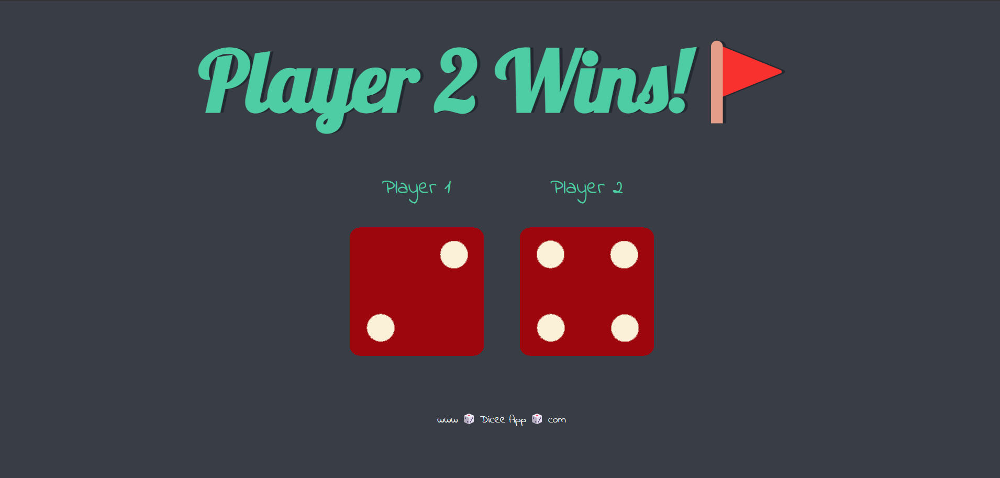

# Dicee Website

Welcome to the Dicee website repository! This is a simple web-based dice game built using HTML, CSS, and JavaScript. The game simulates rolling two dice and displays the results on the webpage.

## Preview

Here's a preview of the Dicee website:



## Broadcast Link

Visit my website here: [https://utkarsh1244p.github.io/Move-It/](https://utkarsh1244p.github.io/Dicee---Game-Of-Dice/)

## Installation

To run the Move It app locally, follow these steps:

1. **Clone the repository:**

   ```bash
   git clone https://github.com/Utkarsh1244p/Dicee---Game-Of-Dice.git

2. **Navigate into the project directory:**

   ```bash
   cd move-it-app

3. **Open the index.html file in your web browser.**

## Folder Structure
The repository has the following structure:
```bash
dicee-website/
├── index.html
├── styles/
│   └── styles.css
├── scripts/
│   └── index.js
└── images/
    └── dice1.png
    └── dice2.png
    └── dice3.png
    └── dice4.png
    └── dice5.png
    └── dice6.png

